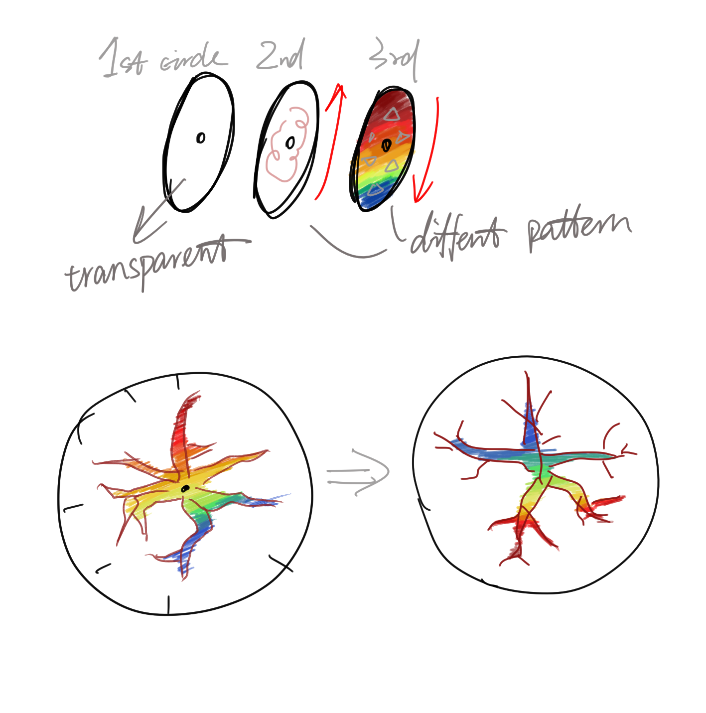
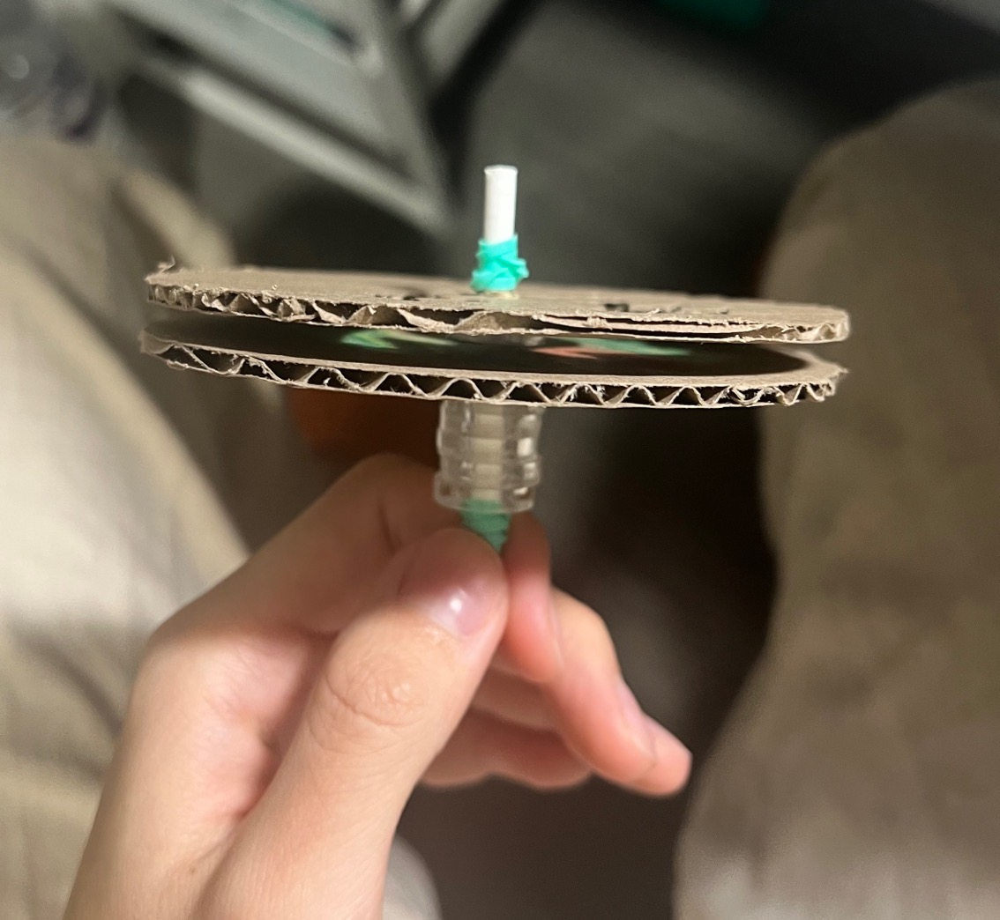
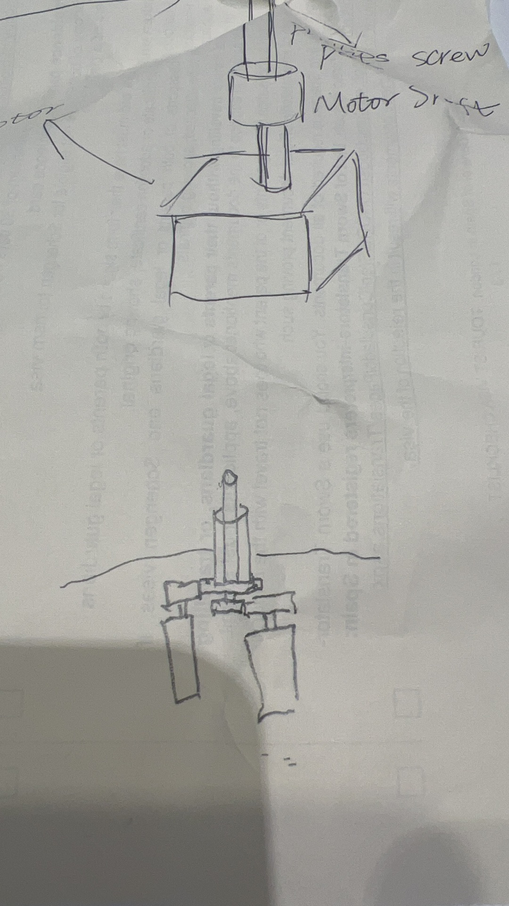
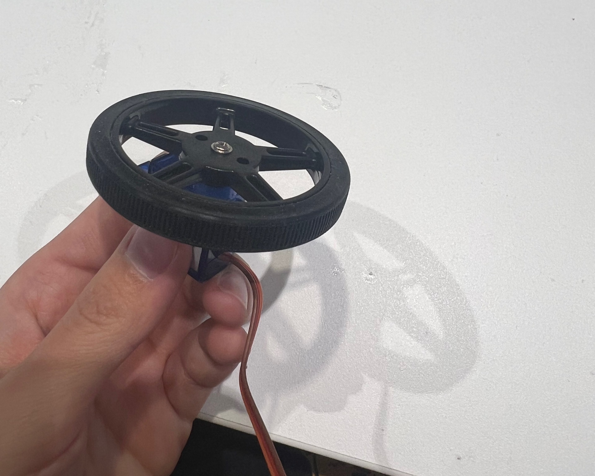
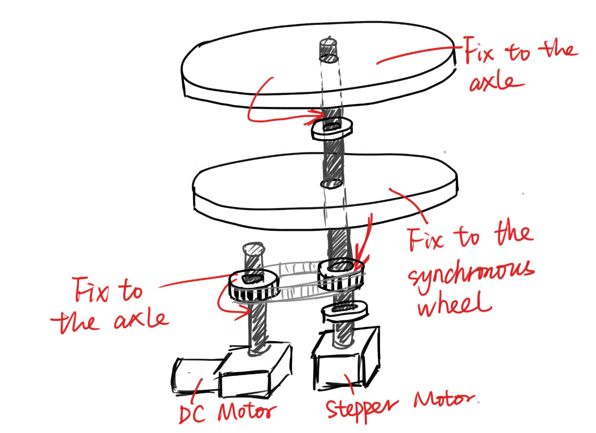
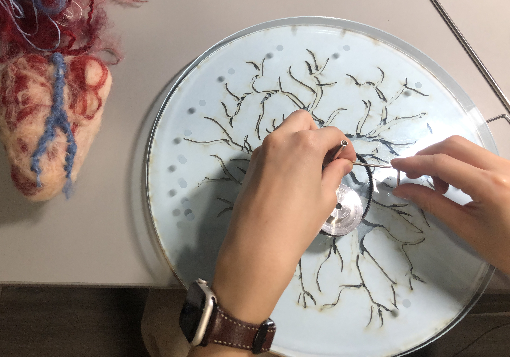
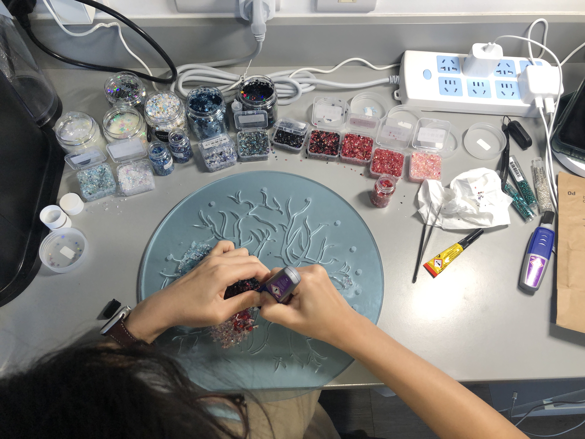
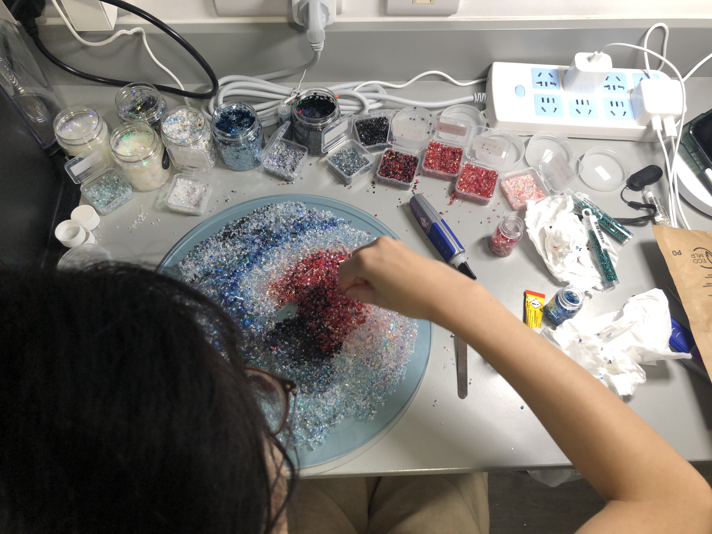
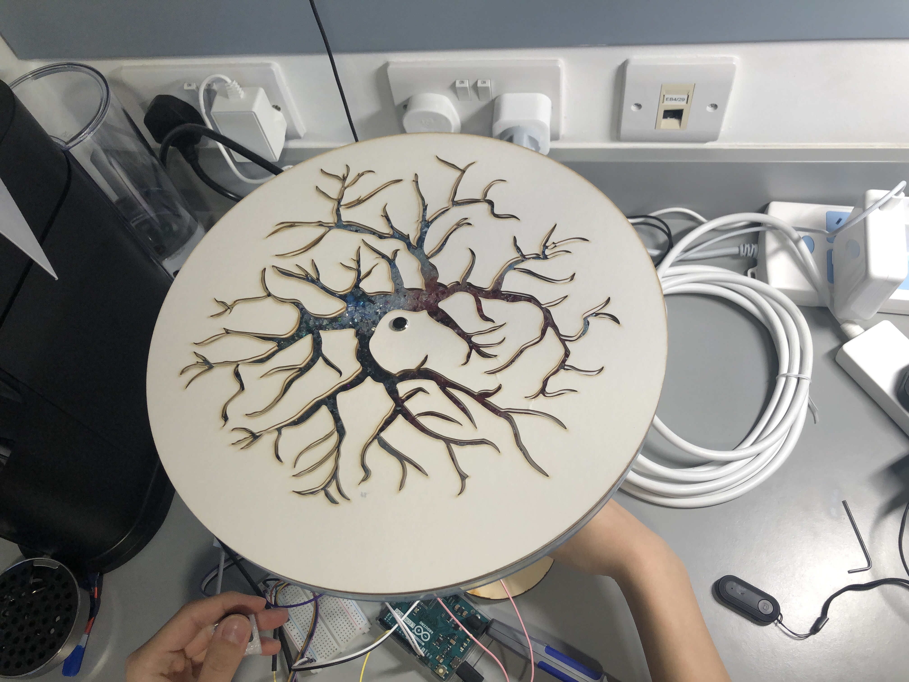
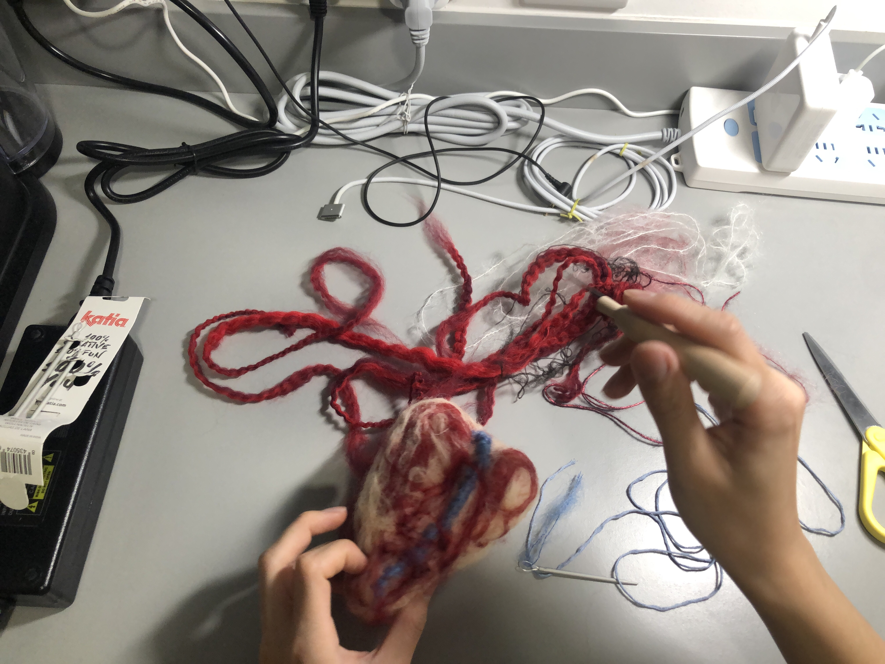

# MSc Advanced Project Blog - Clock of Life

## Project Brief
I once had a discussion the topic of death with my friends. Most of us feel some kind of fear when talk about death. This stems not only from the fear of the end of one's own life, but also from the pain of losing those close to them. Death often carries a heavy burden on people, so many people choose to avoid this sensitive topic, which also makes them feel helpless when they actually face death.

Therefore, I planned to do an interactive installation on the theme of "life and death," which would include some physics experiments. I hope viewers will come to a different understanding and thinking about death through this interactive installation.

## Ideation
### Research
Human's concept of life and death varies due to cultural, religious and other reasons.  Therefore, I think I need to understand people's views on death from a different perspective before I start the project.

People's perceptions of death are often influenced by their religious beliefs. Those with higher levels of religious belief had lower levels of death anxiety. They accept death in a more neutral way. In contrast, people with no religious affiliation were more likely to have death anxiety and positive attitudes about extending life.

In addition, the degree of death anxiety is also related to different regional cultures.

There are some taboos about death in East Asian cultures. For example, people sometimes avoid talking about death, especially on celebratory occasions. In addition, for traditional East Asians, especially Chinese, the same pronunciation as "death" is considered unlucky. For example, the word for the number "4" and "clock" in Chinese is pronounced the same as "death", so people should not give clocks or watches as gifts, and should also avoid giving things with a number of 4. Although many younger generations of East Asians are more open to these traditional taboos, the influence of such traditional thinking persists.

There are different attitudes towards death, even if there are certain differences among people from different cultural backgrounds, there are still some common points.
In every culture people mourn the dead. In a sense, people respect death, which is also a respect for life.

The famous philosopher Nietzsche once proposed "eternal reincarnation". He believed that the lives of dead individuals would reappear countless times in infinite time. The famous ancient Chinese philosopher Zhuangzi believed that death is another form of life, not the end of life, but the beginning of life.

In addition to discussing personal death, the death of someone close to you is also worth exploring in depth. In my research, I found that the death of a family member or friend is more difficult for many people to accept than their own death. They tend to avoid thinking about it, which caused some difficulties during my research. In order to clarify the research direction, I interviewed several participants. For one questionnaire, I designed a scenario: if a relative or friend is seriously ill and needs rescue, and the doctor tells the patient that he or she may not be able to live a normal life or even enter a vegetative state after rescue, will they still choose to continue rescue? Most respondents said it would be difficult for them to decide to give up on saving their loved ones unless the patient had previously made it clear that they did not want to be saved, even if the patient could still suffer. One interviewee even told me that she was afraid to face such a question. She didn't want to think about such a difficult choice ahead of time, which made it impossible for her to continue discussing the topic with me.

In the face of the death of another, people often suddenly experience a great sense of loss, which is difficult to accept and let go. After the loss of a loved one, it takes a long time for us to adjust and accept the loss. And, even after a long time has passed, we may not be able to fully let go. Certain scenes or things touch our heartstrings and remind us of them at certain moments, which make us ache and miss them. Therefore, how to achieve emotional relief is an important and in-depth issue.

I intend to explore life and death from a philosophical perspective through an interactive installation, and I will consider how to incorporate the sense of "finding closure" regarding the passing of a loved one.

In my work, I would like to show life and death as a never-ending cycle. "Life" is the beginning of the cycle, while "death" signifies its conclusion. However, with every ending comes a new beginning, and the chain of life continues.

### Concept Development

After conceptualizing the concept of the "circle of life," I encountered the challenge of how to concretize this "circle." I need to find a way to interact and engage the audience. Furthermore, I aim for this work to reach the viewers.

Under the suggestion from my supervisor Jen, I experimented with several different types of sensors and found some inspiration by studying the work of other artists. And I went to several material shops to explore if there was anything I could use.

I saw tools for making clocks for children in a shop, and it made me realize that I might be able to make a clock. The time on the clock is 0 o 'clock to 23:59 day after day, which is so similar to the cycle of life. What's more, "clock" sounds similar to the Chinese word "death", which has some symbolic meaning.

However, this clock needs to be different from a regular clock. I think it needs to be able to show the audience the process of life from birth to death, and then from death to birth again. And the interaction between the audience and the interactive installation is critical. The audience is in a sense part of this interactive installation that triggers the “circle of life”.

I considered creating a simulated heart on which the audience can perform CPR. This act initiates the “Circle of Life”, and each CPR attempt by the viewer is like a desperate bid to save a life.   However, all life has its endpoint, marking the inevitable completion of the circle of life. This conclusion does not signify the ultimate end, as every end heralds a new beginning. The intervals on the clock's dial can gradually decrease, simulating the journey towards “death”. At the inception of the “Circle of Life”, it is relatively easier for the audience to save this “life”. But as the hands of the clock edge closer to the endpoint, it races rapidly towards zero, symbolizing the inevitable and the futility in trying to rescue the “life”.

  

However, the detailed design of the clock requires deeper consideration. In my initial search for inspiration, I considered elements that could symbolize life and death. To depict life, I thought of using vibrant green and red, with green representing life and red symbolizing blood. For representing death, I considered using black, dark tones, fallen leaves, stars, and butterflies.

  
  

For the first version of the prototype, I came up with the idea of using a mechanical butterfly as the bell of this clock, which rings the bell when time returns to zero. But after discussing it with Jen, my supervisor, I realized that I should focus more on the design of the clock face than the rest of it.

While designing the clock face, I came across some interesting materials while seeking inspiration. A paper-cut artwork captivated me.   Its creator had carved doves' shape from thick cardboard and took it outdoors, providing a unique view of the natural scenery through the cut-out shapes. Another source of inspiration was a drawing from the book 'The Ecological Relations of Roots' by John Ernest Weaver (1919), which illustrates a plant's root system but reminded me of human blood vessels.   This sparked an idea to merge the pattern of blood vessels with hollow carving, allowing viewers to observe life's pulsations through the "blood vessels". Similarly, this design could also represent tree roots, as both roots and blood vessels are symbols of life.

  
  

I plan to make a clock face made of three superimposed coaxial discs. The topmost disc is transparent, engraved with time scales and remaining fixed. The second disc layer is made of opaque material with a blood vessel cutout design, allowing one to see through to the third layer. The bottom disc is made of colorful materials, representing life. I imagine that the second and third discs could be rotated according to the audience's interaction, such as through a heart rate sensor that detects the audience's heart rates and displays varying patterns based on the different readings.

  

  
  

### Determine Design Objectives

  

My goal is to control two outputs with two inputs. The first input is the heart rate sensor. The sensor will be connected to the experiencer's finger, and when the sensor recognizes the different heart rates of different experiencers, it will control the rotation of the clock face disc, resulting in different heart rate patterns. The other sensor is the compression pressure sensor. It will be placed in a simulated heart, and the experiencer could perform "CPR" to control the rotation of the clock hand.

  

My second prototype was made of three discs that were placed upright. I found it difficult to control the rotation of the three disks during the test. And I was planning to use acrylic as the material for my clock face. I think the load bearing and structure are also problems. After a round of iterations, I got my third version of the prototype. With this version in mind for load-bearing issues, I have removed the top disc from the previous version. And I considered placing the other two horizontally. After experimenting, I thought this version could be achieved.

I was going to use the compression pressure sensor to control the top clock face with blood vessel cutout design and the heart rate sensor to control the patterned bottom clock face.  The top clock face needs to reflect the passing of life to the experiencer.  So the effect I would like to achieve is that when the experiencer begins to "save" this "life", it is easy to move to the next scale, and gradually becomes more difficult.  So I want to control the twelve intervals of the clock of life to get smaller and smaller.  Therefore, I considered using a stepper motor to control the rotation Angle of the top clock face.  Due to the weight of the two layers of acrylic sheets, I considered using a DC motor with high torque to control the underlying clock face.

## Experimentation
### Test - Stepper Motor

  

### Test - Heart Rate Sensor

  
  

### Laser Cutting

  
  

  

I used illustrator to design patterns requiring laser cutting and booked a laser cutting workshop at CCI. I finally successfully completed the laser cutting under the guidance of Chris. I used acrylic sheet to cut out the bottom clock face, and used white thick cardboard to cut out the upper clock face with a blood vessel pattern. In addition, I also cut a transparent disk of equal radius to support the cardboard and some small disks to separate the two clock faces.

## Mechanical Design

I need to control the top clock face through the stepper motor and the bottom clock face through the DC motor. The two clock faces are coaxial. I thought I could put the upper and lower layers through the shaft of the stepper motor. I need to make the top layer fixed to the stepper motor shaft and the bottom layer not fixed. Then I can make the top clock face rotate with the shaft of the stepper motor.

  
  

I had trouble controlling the rotation of the underlying clock face, so I booked the tutorial and asked Matt for advice. Matt introduced me to the internal structure of the clock and recommended the wheels for servo, which provided me with inspiration. I thought I could use gears or synchro wheels. 

  
  

I fixed the synchronous wheel used to control the rotation of the belt on the rotating shaft of DC motor, and fixed the bottom clock face with the controlled synchronous wheel. In this way, when the DC motor starts to work, the synchronous wheel on the DC motor rotating shaft will also rotate synchronously with the shaft, so as to control the rotation of the bottom clock face through the pulley.

  
  

  
  

The shaft of the stepper motor and the DC motor was not long enough, so I needed to extend their shaft. I use a coupling to achieve this effect.

## Appearance Optimization
I used some colored beads and sequins to create the pattern of the underlying clock face.

  
  

I layered the two clock faces on top of each other after completion. However, I noticed that the opacity of the top layer impaired the light transmission, making it difficult to see the colored patterns on the bottom layer through the hollow, even in a well-lit room.

  
  

    

    

  
  

  
  

## Final Test

  

## Final Product

## User Experience
